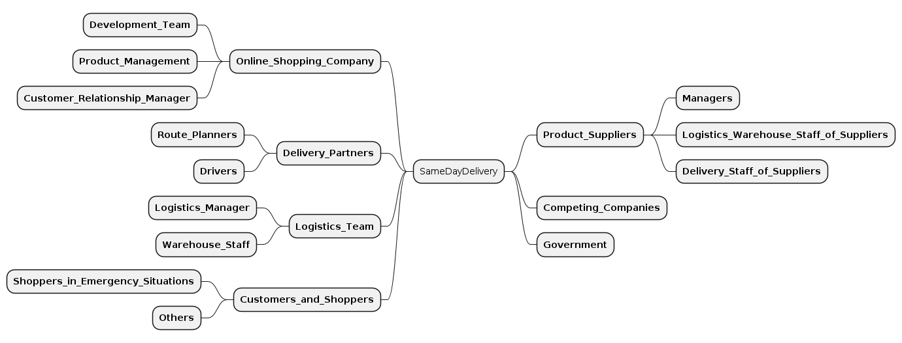

The CML language supports the modelling of stakeholders of (digital) solutions and/or projects. This feature has been introduced to support the [JEDi project](tbd) and its Value-Driven Analysis and Design (VDAD) process. One part of this process supporting ethical software engineering is the identification of all relevant stakeholders. For more information about the whole process we refer to the [JEDi page](tbd). However, modelling stakeholders can support your requirements engineering process in different ways; no matter whether you apply VDAD or JEDi practices.

**Note**: With our [PlantUML generator](/docs/plant-uml/) you can automatically generate [Stakeholder Maps](tbd), once you modelled all your stakeholders and stakeholder groups. See example below.

## Stakeholders Container
On the root level of a CML file, one first needs to create a `Stakeholders` container. This can be done as simply as follows:

<pre>Stakeholders {

  // add stakeholders and stakeholder groups here

}
</pre>

However, if you want to model the stakeholders for a specific [Bounded Context](/docs/bounded-context/), you can declare that as follows:

<pre class="highlight">BoundedContext ExampleContext

Stakeholders of ExampleContext {

  // add stakeholders and stakeholder groups here

}
</pre>

## Stakeholders
Inside a `Stakeholders` container, you can define your stakeholders. This can be done with the `Stakeholder` keyword an the name of the stakeholder:

<pre>BoundedContext ExampleContext

Stakeholders of ExampleContext {

  Stakeholder Shopper

  Stakeholder Software_Engineer

  Stakeholder Architect

  // etc.

}
</pre>

In addition, you can provide additional information for a stakeholder using the `description`, `incluence` and `interest` keywords:

<pre>BoundedContext ExampleContext

Stakeholders of ExampleContext {

  Stakeholder Shopper {
    description &quot;Is using the shopping system to by everday goods.&quot;
    
    influence MEDIUM
    interest HIGH
  }

}
</pre>

The `description` just describes why and/or how the stakeholder uses the system or is impacted by the system. As suggested by many stakeholder mapping tutorials (see [Miro](https://miro.com/blog/stakeholder-mapping/) or [Mural](https://www.mural.co/blog/stakeholder-mapping)), you can define what the `incluence` of the stakeholders is and how much they are interested (`interest`) in the new system or feature.

## Stakeholder Groups
Stakeholder maps often group stakeholders of similar roles or with similar interest together. This is also possible in CML with the `StakeholderGroup` keyword, which can again contain stakeholders with the `Stakeholder` keyword:

<pre>BoundedContext ExampleContext

Stakeholders of ExampleContext {

  StakeholderGroup Online_Shopping_Company {
    Stakeholder Development_Team {
      influence MEDIUM
      interest HIGH
    }
    Stakeholder Product_Management {
      influence HIGH
      interest HIGH
    }
    Stakeholder Customer_Relationship_Manager {
      influence HIGH
      interest MEDIUM
    }
  }

  Stakeholder Shopper {
    description &quot;Is using the shopping system to by everday goods.&quot;
    
    influence MEDIUM
    interest HIGH
  }

}
</pre>

## Visualization: Stakeholder Map
Once your stakeholders are modelled in CML, you can generate a visual stakeholder map automatically. An example:

Check out our [PlantUML generator](/docs/plant-uml/) on how to generate such a diagram.
