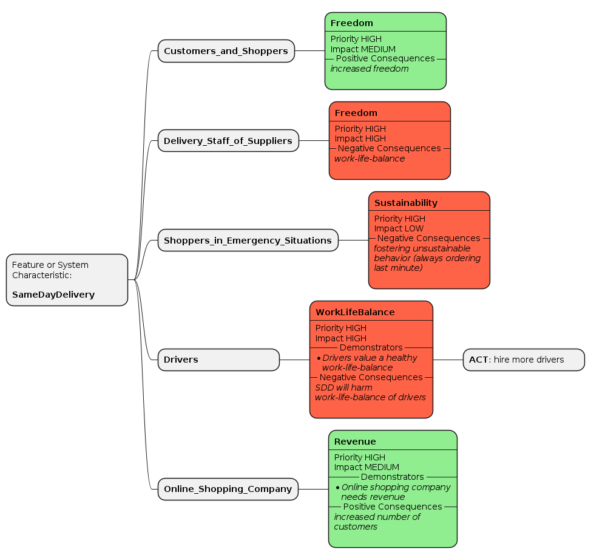

The CML language supports the modelling of stakeholders and their values that might be strengthened or harmed by digital systems. This feature has been introduced to support the [JEDi project](tbd) and its Value-Driven Analysis and Design (VDAD) process. Context Mapper and the language concepts documented on this page therefore support the modelling of ethical concerns in software projects. For more information about the whole process we refer to the [JEDi page](tbd).

**Note**: Some of the terminology of the language, such as value register or value cluster, is based on the [IEEE Standard Model Process for Addressing Ethical Concerns during System Design (a.k.a. IEEE 7000 standard)](https://ieeexplore.ieee.org/document/9536679). However, you do not necessarily need to know that terminology; you can also simply model the values of your stakeholders within a `ValueRegister` block.

## Value Register
If you are interested in reading more about the ideas of a _value register_, we refer to the [Glossary of ESE](https://github.com/ethical-se/ese-practices/blob/main/ESE-Glossary.md) or the [IEEE 7000 standard](https://ieeexplore.ieee.org/document/9536679). However, if you just want to move on quickly and model the values of your stakeholders - just consider the value register a _container object_ that allows to model values for a specific Bounded Context:

<pre>BoundedContext Online_Shop_Same_Day_Delivery

ValueRegister SDD_Stakeholder_Values for Online_Shop_Same_Day_Delivery {
  // model values inside value register
}
</pre>

If you just want to start to model some values without separating by Bounded Contexts, you can create a `ValueRegister` without that reference:

<pre>ValueRegister SDD_Stakeholder_Values {
  // model values inside value register
}
</pre>

## Values

Inside a value register you can define the values important to your project, software and/or feature:

<pre>ValueRegister SDD_Stakeholder_Values {
  
  Value Privacy
  Value Respect
  Value Integrity
  Value Love
  // etc.

}
</pre>

The following attributes that can be added, namely whether a value is a _core value_, _value demonstrators_, _related values_ and _opposing values_, follow the terminology of the [IEEE 7000 standard](https://ieeexplore.ieee.org/document/9536679). We refer to the standard or the [ESE Glossary](https://github.com/ethical-se/ese-practices/blob/main/ESE-Glossary.md) for a more detailed introduction into these terms; in CML the attributes are however not mandatory.

<pre>ValueRegister SDD_Stakeholder_Values {
  
  Value Privacy {
    isCore

    demonstrator = &quot;right to be left alone&quot;
    demonstrator = &quot;the right to refuse sharing private data&quot;
    relatedValue = &quot;Intimacy&quot;
    opposingValue = &quot;Transparency&quot;
    opposingValue = &quot;Inclusiveness&quot;
  }

}
</pre>

As always in CML, the 'equal' (=) sign is optional:

<pre>ValueRegister SDD_Stakeholder_Values {
  
  Value Privacy {
    isCore

    demonstrator &quot;right to be left alone&quot;
    demonstrator &quot;the right to refuse sharing private data&quot;
    relatedValue &quot;Intimacy&quot;
    opposingValue &quot;Transparency&quot;
    opposingValue &quot;Inclusiveness&quot;
  }

}
</pre>

<strong>Note:</strong> Just by modelling values as seen here, does not allow you to generate any visualization (at least for now). Continue with the section <a href="#stakeholder-priorisation-impact--consequences">Stakeholder Priorisation, Impact & Consequences</a>, do define how important these values are to the individual stakeholders and how they are affected. After that you can generate a [Value Stakeholder Map](tbd) wit the <a href="/docs/plant-uml/">PlantUML generator</a>.

## Value Clusters

If one applies or follows the [IEEE 7000 standard](https://ieeexplore.ieee.org/document/9536679), values are clustered around core values. For example, the value _confidentiality_ (a demonstrator could be: _right to be left alone_), is an enabler for the core value of _privacy_. Therefore the value _confidentiality_ would be added to the value cluster with the core value _privacy_. This can be modelled in CML as follows:

<pre>ValueRegister SDD_Stakeholder_Values {
  
  ValueCluster Privacy {
    core PRIVACY

    Value Confidentiality {
      demonstrator = &quot;right to be left alone&quot;  
    }
  }

}
</pre>

The _core value_ can be modelled as shown above, by using the enumeration CML provides. That enumeration contains all _core values_ according to the [IEEE 7000 standard](https://ieeexplore.ieee.org/document/9536679): `AUTONOMY`, `CARE`, `CONTROL`, `FAIRNESS`, `INCLUSIVENESS`, `INNOVATION`, `PERFECTION`, `PRIVACY`, `RESPECT`, `SUSTAINABILITY`, `TRANSPARENCY`, `TRUST`.

Alteratively, you can define the core value by a custom string:

<pre>ValueRegister SDD_Stakeholder_Values {
  
  ValueCluster MyCluster {
    core &quot;Respect&quot;
  }

}
</pre>

Further note that the attributes `demonstrator`, `relatedValue` and `opposingValue`, as documented for the `Value` object already, can also be applied to value clusters:

<pre>ValueRegister SDD_Stakeholder_Values {
  
  ValueCluster Privacy {
    core PRIVACY

    demonstrator = &quot;right to be left alone&quot;
    demonstrator = &quot;the right to refuse sharing private data&quot;
    relatedValue = &quot;Intimacy&quot;
    opposingValue = &quot;Transparency&quot;
    opposingValue = &quot;Inclusiveness&quot;
  }

}
</pre>

Generally, you can cluster values in CML but you do not necessarily have to.

<strong>Note:</strong> Just by modelling values and value clusters as seen here, does not allow you to generate any visualization (at least for now). Continue with the section <a href="#stakeholder-priorisation-impact--consequences">Stakeholder Priorisation, Impact & Consequences</a>, do define how important these values are to the individual stakeholders and how they are affected. After that you can generate a [Value Stakeholder Map](tbd) wit the <a href="/docs/plant-uml/">PlantUML generator</a>.

## Stakeholder Prioritization, Impact & Consequences

Note that the following model snippets require stakeholder modelling as precondition; please check the page [Stakeholders](/docs/stakeholders/) for the corresponding CML syntax.

The following example illustrates how you can assign the values ​​to the stakeholders who care about them. For each stakeholder you can define the `PRIORITY` this value has for the stakeholder, as well as the `IMPACT`. The `consequences` section allows you to model `good`, `bad`, and `neutral` consequences your system or feature has to the given value - from the perspective of the specific stakeholder:

<pre>BoundedContext SameDayDelivery

Stakeholders of SameDayDelivery {
  StakeholderGroup Customers_and_Shoppers
  StakeholderGroup Delivery_Staff_of_Suppliers
}

ValueRegister SD_Values for SameDayDelivery {  
  Value Freedom {
      Stakeholder Customers_and_Shoppers {
        priority HIGH
        impact MEDIUM
        consequences
          good &quot;increased freedom&quot;
      }
      Stakeholder Delivery_Staff_of_Suppliers {
        priority HIGH
        impact HIGH
        consequences
          bad &quot;work-life-balance&quot;
      }
    }
}
</pre>

This is again possible on the level of a `Value`, but as well on a `ValueCluster`:

<pre>BoundedContext SameDayDelivery

Stakeholders of SameDayDelivery {
  StakeholderGroup Customers_and_Shoppers
  StakeholderGroup Delivery_Staff_of_Suppliers
}

ValueRegister SD_Values for SameDayDelivery {  
  ValueCluster Freedom {
      core AUTONOMY
      Stakeholder Customers_and_Shoppers {
        priority HIGH
        impact MEDIUM
        consequences
          good &quot;increased freedom&quot;
      }
      Stakeholder Delivery_Staff_of_Suppliers {
        priority HIGH
        impact HIGH
        consequences
          bad &quot;work-life-balance&quot;
      }
    }
}
</pre>

## Mitigation Actions

In case your system has negative impact on values, you might want to model the mitigation actions you consider to implement to reduce harm. The following example shows how to model such mitigation actions in CML:

<pre>BoundedContext SameDayDelivery

Stakeholders of SameDayDelivery {
  StakeholderGroup Drivers
}

ValueRegister SD_Values for SameDayDelivery {  
  Value WorkLifeBalance {
    demonstrator &quot;Drivers value a healthy work-life-balance&quot;
    Stakeholder Drivers {
      priority HIGH
      impact HIGH
      consequences
        bad &quot;SDD will harm work-life-balance of drivers&quot;
          action &quot;hire more drivers&quot; ACT
    }
  }
}
</pre>

The action types can be `ACT` (actively do something to reduce harm to values), `MONITOR` (just monitor the issue; maybe to gather more information), or a custom string.

## Example
For a complete example, we refer to the [example repository](https://github.com/ContextMapper/context-mapper-examples). There you can find a complete CML model for the "Same Day Delivery" example. 

Once you have modelled your values and stakeholder priorities and impact, you can generate a [Value Impact Map as suggested by the JEDi project](tbd). The diagram is part of the [PlantUML generator](/docs/plant-uml/).

## Additional ESE Formats

The following additional (experimental) CML features allow users to apply [Story Valuation by ESE](https://github.com/ethical-se/ese-practices/blob/main/practices/ESE-StoryValuation.md) and use the suggested notations _Value Epic_, _Value Weighting_ and _Value Narrative_.

<strong>Note:</strong> These language features are experimental and currently not used by any generator. The modelled information can therefore not be visualized, except you use the <a href="/docs/generic-freemarker-generator/">Generic Generator (Templating with Freemarker)</a> and process the data on your own.

<pre>Stakeholders {
  Stakeholder Conference_Participant
}

ValueRegister Conference_Management_Sample {  
  ValueEpic Data_Privacy {
    As a Conference_Participant
    I value &quot;data privacy&quot;
    as demonstrated in 
      realization of &quot;confidentiality of sensitive personal information such as my passport number&quot; 
      reduction of &quot;efficiency of operations for conference mansagement staff&quot;
  }

  ValueWeigthing Data_Privacy {
    In the context of the SOI,
    stakeholder Conference_Participant values &quot;data privacy&quot; more than &quot;efficiency from a registration management staff point of view&quot;
    expecting benefits such as &quot;confidentiality of sensitive personal information&quot;
    running the risk of harms such as &quot;higher conference fees and a slower registration process.&quot;
  }
}

ValueRegister Same_Day_Delivery_Sample {
  ValueNarrative Sample_Narrative {
    When the SOI executes &quot;the same say delivery epic (incl. split user stories that meet the INVEST criteria)&quot;,
    stakeholders expect it to promote, protect or create &quot;freedom and quality of life&quot;,
    possibly degrading or prohibiting &quot;work-life balance of suppliers and shopper privacy&quot;
    with the following externally observable and/or internally auditable behavior:

    &quot;Given: Shop is operational and suited suppliers and logistics firms are available. 
    When: Same day delivery is promised during order acceptance and confirmation. 
    Then: Order arrives at shipment address until 11:59pm on the same say.&quot;
  }
}
</pre>

